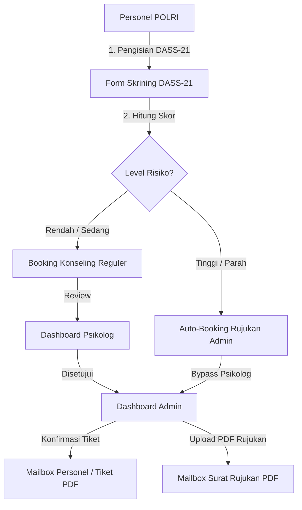

# 🛡️ KEHATI (Kesehatan Hati) — Product Context & Architectural Overview

Platform Konseling & Skrining Kesehatan Mental Digital — Biro SDM Polda Jawa Barat.

---

## 📌 1. Nama & Ringkasan Produk

- **Nama Produk**: KEHATI (Kesehatan Hati)
- **Instansi**: Biro SDM Polda Jawa Barat
- **Visi**: Mewujudkan layanan kesehatan mental yang aksesibel, rahasia, terstruktur, dan responsif bagi seluruh anggota personel POLRI di wilayah hukum Polda Jawa Barat.

---

## 🎯 2. Tujuan Produk

1. **Deteksi Dini Mandiri**: Memfasilitasi personel POLRI untuk mengukur kondisi psikologis secara berkala menggunakan standar instrumen **DASS-21** (Depression, Anxiety, and Stress Scale).
2. **Penjadwalan Konseling Terstruktur**: Mempermudah pemesanan sesi konseling baik secara daring (Google Meet/Zoom) maupun luring (Tatap Muka di Biro SDM/Mapolda).
3. **Triage & Intervensi Cepat Kasus Risiko Tinggi**: Memungkinkan alur *bypass* klinis otomatis di mana personel dengan hasil skrining **Risiko Tinggi (Parah)** langsung diteruskan ke Admin SDM untuk penerbitan **Surat Rujukan Penanganan Lanjutan (PDF)**.
4. **Manajemen Terpusat & Akuntabel**: Menyediakan dashboard khusus bagi Psikolog dan Admin untuk memverifikasi jadwal, mengelola pengguna, dan mempublikasikan konten edukasi psikologi.

---

## 💻 3. Teknologi yang Digunakan (Tech Stack)

### **Frontend Layer**
- **Framework**: Next.js 16 (App Router)
- **UI Core**: React 19, TypeScript
- **Styling**: Vanilla CSS, TailwindCSS v4, Google Material Symbols Outlined
- **Notifikasi**: `sonner` (Toast Notifications)

### **Backend & Database Layer**
- **Database Engine**: Serverless PostgreSQL (Hosted on [Neon.tech](https://neon.tech))
- **ORM**: Prisma ORM v6 (`@prisma/client`)
- **API Runtime**: Next.js Server Actions & Route Handlers

### **DevOps & Tooling**
- **Type Checker**: TypeScript Compiler (`tsc`)
- **Seeding Engine**: `tsx` (TypeScript Executor for Prisma Seed)

---

## 🏗️ 4. Arsitektur Sistem & Alur Kerja Data



### **Model Hak Akses (Role-Based Access Control / RBAC)**:
1. **Personel**: Melakukan skrining DASS-21, pemesanan konseling, melihat tiket aktif, membaca berita SDM, dan mengakses kotak masuk (Mailbox).
2. **Psikolog**: Meninjau pengajuan jadwal konseling kategori risiko rendah/sedang (`pending_psikolog`), mengedit detail sesi, dan menandai sesi selesai (`completed`).
3. **Admin**: Verifikasi akhir jadwal konseling (`pending_admin`), penanganan rujukan kasus risiko tinggi (unggah PDF rujukan), manajemen akun pengguna, dan pengelolaan portal berita (CRUD).

---

## ⭐ 5. Fitur-Fitur Utama Platform

| Fitur | Deskripsi |
| :--- | :--- |
| **Skrining DASS-21 Mandiri** | 21 pertanyaan psikologis standar untuk mengukur tingkat depresi, kecemasan, dan stres dengan visualisasi grafik skor interaktif. |
| **Smart Auto-Triage & Booking** | Sistem otomatis mengarahkan alur pengajuan berdasarkan hasil risiko. Risiko rendah/sedang ke Psikolog, risiko tinggi langsung ke Admin. |
| **Unggah & Unduh PDF Rujukan Resmi** | Admin dapat melampirkan file PDF Surat Rujukan (max 5MB) yang dapat diunduh secara native oleh personel melalui Mailbox. |
| **Tiket Konseling & Cetak PDF** | Tiket digital lengkap dengan detail sesi, lokasi/link meeting, instruksi, dan QR Code verifikasi siap cetak. |
| **Dashboard Realtime Multi-Peran** | Area kerja khusus Personel, Psikolog, dan Admin dengan *live data polling* setiap 3 detik. |
| **Real-Time Upcoming Schedule Widget** | Widget jadwal mendatang di dashboard personel yang memuat sesi aktif (hari ini s.d masa depan) dan terurut otomatis. |
| **Mailbox Mandiri & Notifikasi Lonceng** | Sistem pesan internal dengan dukungan spasi newline (`whitespace-pre-wrap`), badge unread, dan redireksi notifikasi pintar. |
| **Proteksi Pembatalan Hari H** | Mencegah pembatalan tiket secara mendadak pada hari H pelaksanaan konseling. |
| **Kelola User & Warning Modals** | Fitur registrasi Admin/Psikolog baru, ubah peran, blokir/aktifkan akun dengan modal konfirmasi warning kustom. |
| **CRUD Portal Berita SDM** | Manajemen artikel edukasi kesehatan mental (Create, Read, Update, Delete) oleh Admin. |
| **Modal Bantuan Lupa Password** | Pop-up panduan prosedur lupa password via kontak verifikasi Admin SDM demi keamanan data personel. |

---

## 🗄️ 6. Struktur Skema Database (Prisma Models)

- **`User`**: Menyimpan data identitas personel (NRP, Nama, Pangkat, Satker, Role, Status Akun).
- **`Psikolog`**: Data master konselor/psikolog biro SDM.
- **`Slot`**: Slot waktu ketersediaan konseling (Daring/Luring, Lokasi, Kapasitas).
- **`Screening`**: Riwayat pengisian DASS-21, skor kategori, dan status validasi.
- **`Booking`**: Transaksi pemesanan konseling, nomor tiket (`TKT-YYYY-XXXXX`), status alur, dan catatan konselor.
- **`MailboxMessage`**: Pesan kotak masuk personel (Notifikasi Tiket, Surat Rujukan PDF, Informasi).
- **`Article`**: Konten berita dan artikel edukasi kesehatan mental.

---

## 📌 7. Perintah Pengembangan & Operasional

```bash
# Menjalankan Server Pengembangan Local
npm run dev

# Membangun Bundle Produksi & Verifikasi Type Check
npm run build

# Menyesuaikan Schema Database ke Neon PostgreSQL
npm run db:push

# Mengisi Data Seed Awal ke Database
npm run db:seed
```
